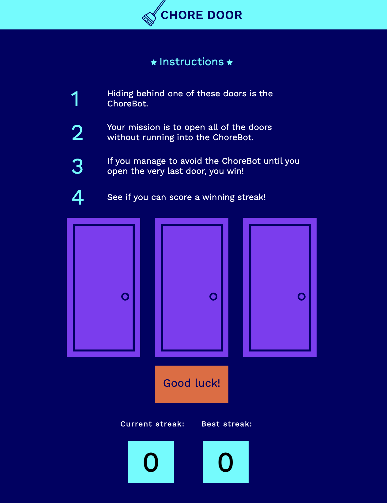
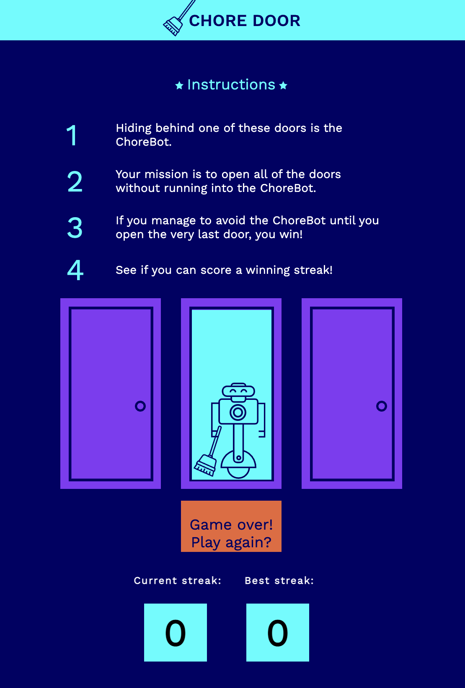
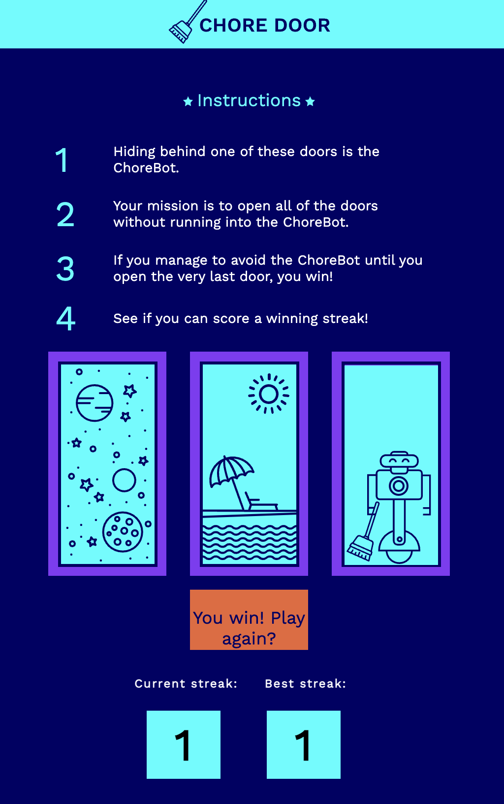

# Chore Door

Chore Door is a simple and fun game that challenges you to open doors without running into the ChoreBot. The game consists of three doors, one of which hides the ChoreBot, your pesky robotic housekeeper. Your goal is to open all three doors without accidentally revealing the ChoreBot behind one of them.

The game starts with all three doors closed, and you must choose one to open. If you're lucky, you'll find a prize behind the door and move on to the next one. But be careful! If you open the door hiding the ChoreBot, the game is over, and you lose.

Chore Door is a game of chance and strategy that will test your memory, reflexes, and luck. It's perfect for a quick break or to challenge your friends to a winning streak. So, give it a try, and see how far you can go without running into the ChoreBot!

## Acknowledgements

 - [Linkedin Learning - Web Programming Foundation](https://www.linkedin.com/learning/web-programming-foundations/welcome?autoplay=true&u=41910396)
 - [Linkedin Learning - Introduction to Web Design and Development](https://www.linkedin.com/learning/introduction-to-web-design-and-development-14628245/web-design-and-development-in-the-code-and-no-code-era?autoplay=true&u=41910396)
- [Codecademy - Web Development](https://www.codecademy.com/learn/paths/web-development)
## Author

- [@bisrat415](https://github.com/bisrat415)

## Screenshots

When the game starts: 

When you lose a game:

When you win one round:

## Color Reference

| Color             | Hex                                                                |
| ----------------- | ------------------------------------------------------------------ |
| Eastern Blue  |  #2596BE |
| Bright Turquoise | #06F0F5 |
| Gulf Blue| #040464 |
| Grape | #35195c |
| Mischka | #d8d8e8 |
| Flamingo | #eb6537 |
| Tory Blue | #115a9c |
| Mischka | #d8d8e8 |
| #4823b4 | #4823b4 |

## Badges

